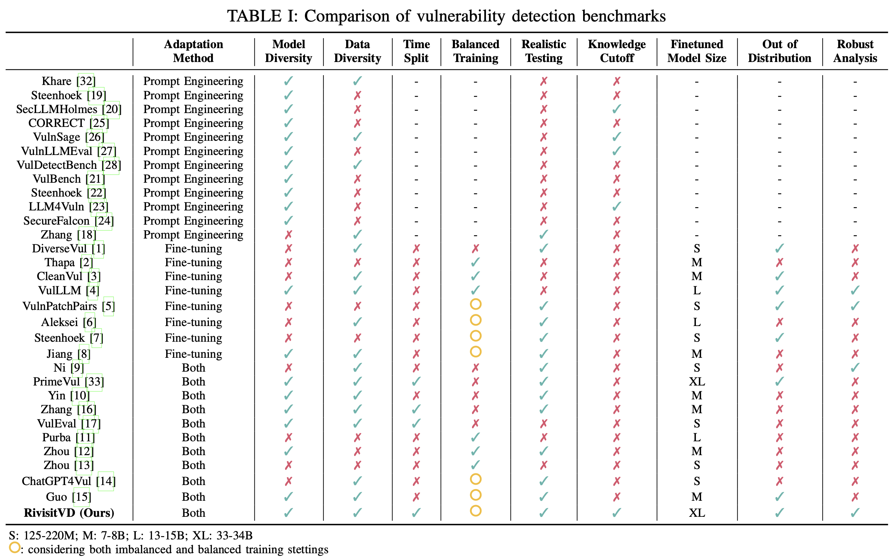

## Revisiting Pre-trained Language Models for Vulnerability Detection

**Abstract**: 

The rapid advancement of pre-trained language models (PLMs) has demonstrated promising results for various code-related tasks. However, their effectiveness in detecting real-world vulnerabilities remains a critical challenge. % for the security community. While existing empirical studies evaluate PLMs for vulnerability detection (VD), their inadequate consideration in data preparation, evaluation setups, and experimental settings undermines the accuracy and comprehensiveness of evaluations. This paper introduces RevisitVD, an extensive evaluation of 17 PLMs spanning smaller code-specific PLMs and large-scale PLMs using newly constructed datasets. Specifically, we compare the performance of PLMs under both fine-tuning and prompt engineering, assess their effectiveness and generalizability across various training and testing settings, and analyze their robustness against code normalization, abstraction, and semantic-preserving transformations.

Our findings reveal that, for VD tasks, PLMs incorporating pre-training tasks designed to capture the syntactic and semantic patterns of code outperform both general-purpose PLMs and those solely pre-trained or fine-tuned on large code corpora. However, these models face notable challenges in real-world scenarios, such as difficulties in detecting vulnerabilities with complex dependencies, handling perturbations introduced by code normalization and abstraction, and identifying semantic-preserving vulnerable code transformations. Also, the truncation caused by the limited context windows of PLMs can lead to a non-negligible amount of labeling errors. This study underscores the importance of thorough evaluations of model performance in practical scenarios and outlines future directions to help enhance the effectiveness of PLMs for realistic VD applications.





### Key Feature:

- Systematically evaluate pre-trained language models for vulnerability detection
- Compare different model architectures and model adaptation strategies (i.e., fine-tuning and prompt engineering)
- Provide insights into the effectiveness of LLMs for vulnerability detection
- Establish benchmarks for future research in this domain


### Installation and Usage:

Please refer to the readme.md in each folder (i.e., finetune and inference).


### Acknowledgement:

- Code base: 
  1. https://figshare.com/ndownloader/articles/25325608?private_link=78fe02e56e09ec49300b
  2. https://www.google.com/url?sa=t&source=web&rct=j&opi=89978449&url=https://github.com/DLVulDet/PrimeVul&ved=2ahUKEwirpc71ntSOAxVyF1kFHY9nBR4QFnoECAsQAQ&usg=AOvVaw1ZaukFpvsfT1hOBCe6RYhS

- Data base:
  1. PrimeVul
  2. NVD

### Citation:

If you use this work in your research, please cite:

```
@misc{li2025revisitingpretrainedlanguagemodels,
      title={Revisiting Pre-trained Language Models for Vulnerability Detection}, 
      author={Youpeng Li and Weiliang Qi and Xuyu Wang and Fuxun Yu and Xinda Wang},
      year={2025},
      eprint={2507.16887},
      archivePrefix={arXiv},
      primaryClass={cs.CR},
      url={https://arxiv.org/abs/2507.16887}, 
}
```


Feel free to contact me if you have any questions :) 

